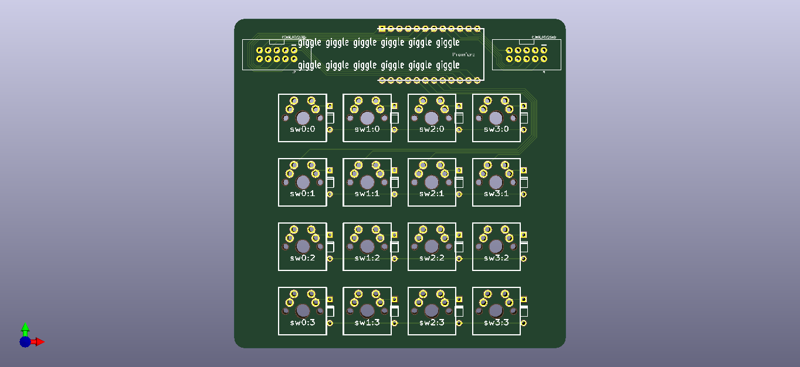
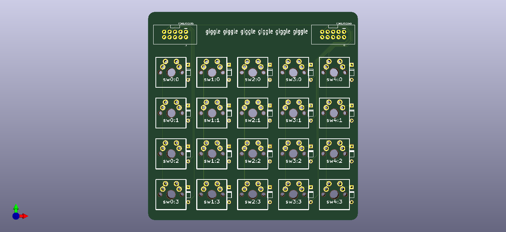
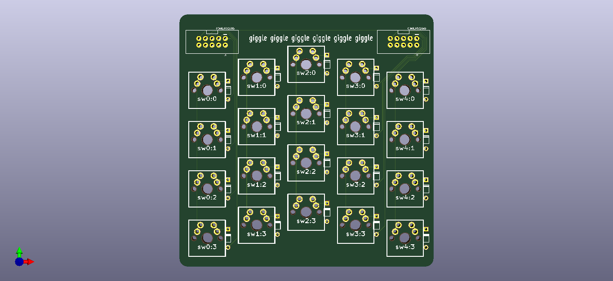

# Giggle Keyboard

You've heard houndstooth and slamd?
Just like those boards but with a middle part as arrow pad.

## What is it?

It's a board which has three parts, consisted of two alpha pads and a numpad.

## I don't get it.

Check the following pics.

As you can see, the first one is the main part of the board where the promicro
is located at.
You can put 16 keys on it and use it as an navigation pad / number pad or whatever
floats your goat.

For the 4x5 ortho or staggered one, you can use two of them, in whatever combination
you want.
But, they can only be placed as the side as you can't use the main part on the
outer part of the combination.

## I still don't get it.

Never mind.

## Oh, I get it! But why? 

The name is the clue.
I write it just for shits and giggles!

## Ok, but where's the firmware?

I haven't written it yet, mate.
But, it will surely use QMK.